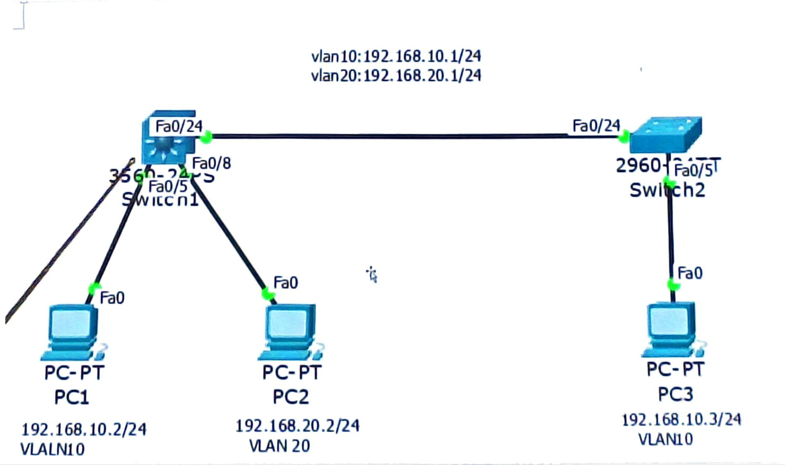
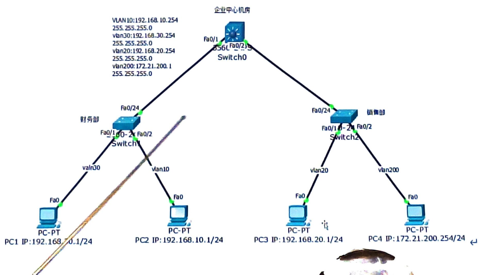

# review-material-network
## 香农定理(p29,30)

- **信道的极限容量**   

    $C = B log_2 (1 + S / N) (bit/s)$

    - S-signal
    - N-noise
    - B-bandwight
    - C-channel capacity

- **信噪比**  

    $SNR = 10 \log_{10} \left(\frac{S}{N}\right) \text{(dB)}$

    - S-signal
    - N-noise 
    - SNR-signal to noise ratio

## 奈氏准则(p29,30)

- **信道最大传输速率**  

    $C = 2 B log_2 N (bps)$

    - N-noise
    - B-bandwight
    - C-channel capacity
    - N-number of discrete signal levels

## CRC 码(p45-47)

- 什么东西

    * 检测数据是不是和发的时候一样。
    * 检错能力极强，单个多个错误都能查。
    * 能硬件实现，极简单、极快。那很快了。
    * 但是无法纠错，只能查错。

- 核心工作原理
    
    CRC 的本质是利用**二进制的除法**（更准确地说是模 2 除法）来生成一段校验码。
    
    1. **发送方**：
        * 在要发送的数据（一串二进制数）后面加上若干个 `0`。
        * 用这个新数据除以一个双方约定的特定二进制数（称为**生成多项式**，Generator Polynomial）。
        * 采用**模 2 除法**（不进位也不借位的除法，其本质就是**异或 XOR 运算**）计算出余数。
        * 这个**余数**就是 **CRC 校验码**。发送方把这个校验码拼接在原始数据后面一起发走。

    2. **接收方**：
        * 收到完整的数据（原始数据 + CRC 校验码）。
        * 用同样的方法除以那个约定的**生成多项式**。
        * **看余数是否为 0**：
        * 如果余数为 **0**：说明数据在传输过程中大概率没有出错，予以接收。
        * 如果余数**不为 0**：说明数据在传输中受干扰变质了，直接丢弃并通常会请求重发。

- 算出

    - 例子
        
        1. 准备已知条件
            * **原始数据（$K$）**：`101001`（6位）
            * **约定好的生成多项式（$G$）**：`1101`（4位）
        
        2. 第一步：补零
            看一眼生成多项式 `1101` 的位数，它是 **4 位**。
            我们在原始数据后面加上 **(多项式位数 - 1)** 个 `0`。也就是加上 $4 - 1 = 3$ 个 `0`。
            * 补零后的被除数变成：`101001 000`

        3. 第二步：模 2 除法运算（求余数）

            用 `101001000` 除以 `1101`。
            *记住原则：只要当前除数对应最高位是 `1`，商就是 `1`，然后上下按位做**异或（相同得0，不同得1）***。

            ```text 
                            1 1 1 1 0 1  <- 商（不用管它，我们只要余数）
                    -------------------
            1 1 0 1 ) 1 0 1 0 0 1 0 0 0  <- 被除数
                    1 1 0 1            <- 除数
                    -------
                    0 1 1 1 0          <- 第一次异或结果，拉下一位 0
                        1 1 0 1          <- 只要最高位是1，就继续用除数消
                        -------
                        0 0 1 1 1        <- 第二次异或结果，拉下一位 1
                        1 1 0 1
                        -------
                        0 0 1 0 0      <- 第三次异或结果，拉下一位 0
                            1 1 0 1
                            -------
                            0 1 0 1 0    <- 第四次异或结果，拉下一位 0
                            0 0 0 0    <- 注意：这里最高位是0，所以商0（即用0000来异或）
                            -------
                            1 0 1 0 0  <- 第五次异或结果，拉下最后一位 0
                            1 1 0 1
                            -------
                            0 1 1 1    <- 最终余数（3位）
            ```

        4. 第三步：得到最终发送的信号

            * 算出的最终余数是：`111`（这就是 **CRC 校验码**）。
            * 将这个校验码替换掉刚才在原始数据后面补的 3 个 `0`。
            最终发送出去的数据流就是：**`101001 111`**
            （前 6 位是原始数据，后 3 位是 CRC 码）。

    - 做法总结

        1. 拿到原数据、生成多项式
        2. 补0，比多项式少1位
        3. 被生成多项式异或除，取余数
        4. 余数替代掉之前补的0(这就是加上校验码的数据)
        5. OK啊，这也是算完了呀

- 校验    

    - 例子

        接收方收到 `101001111` 之后，用它直接除以约定的生成多项式 `1101`（同样用模 2 除法）：
        
        ```text
                        1 1 1 1 0 1
                -------------------
        1 1 0 1 ) 1 0 1 0 0 1 1 1 1
                1 1 0 1
                -------
                    1 1 1 0
                    1 1 0 1
                    -------
                    0 1 1 1
                    1 1 0 1
                    -------
                        0 1 0 1
                        0 0 0 0
                        -------
                        1 0 1 1
                        1 1 0 1
                        -------
                        1 1 0 1
                        1 1 0 1
                        -------
                        0 0 0 0  <- 余数为 0！数据完全正确。
        ```

        因为**余数正好为 0**，接收方就能无比确信地判定：这个数据在路上没有遭到任何篡改或损坏！
    
    - 做法总结

        1. 拿到加上校验码的数据、生成多项式
        2. 被生成多项式异或除，取余数
        3. 全0就是没问题
        4. OK啊，这也是算完了呀

## 子网划分(未知页数)

- 是什么

    子网划分（Subnetting）的就是：**借用主机位来充当网络位**。

- 例子    

    - 背景知识
    
        - **IP地址的组成**：IPv4地址有32位二进制，由 **网络位（Network） + 主机位（Host）** 组成。
        - **子网掩码（Subnet Mask）**：标记哪些位是网络位（用 `1` 表示），哪些位是主机位（用 `0` 表示）。
        - *例如*：`255.255.255.0` 对应的二进制前24位全是1，即 `/24`。
    
    假设我们拿到一个C类网络：**`192.168.1.0/24`**，现在需要把它**平均划分成 4 个子网**。
    
    1.  第一步：确定要借几位（计算网络位）

        原来的网络位是24位，剩余的主机位是 $32 - 24 = 8$ 位。
        我们要划分成 4 个子网，需要多少个二进制位来表示 4 呢？
        根据公式：$2^n = \text{子网数}$


        $2^2 = 4$


        所以，我们需要向主机位**借 2 位**（即 $n=2$）。

    2. 第二步：确定新的子网掩码

        * 原掩码是 24 位：`11111111.11111111.11111111.00000000` (`255.255.255.0`)
        * 新掩码要加上借来的2位，变成 26 位（/26）：`11111111.11111111.11111111.11000000`
        * 把最后八位 `11000000` 转换成十进制，就是 $128 + 64 = 192$。
        * **新子网掩码为：`255.255.255.192**`。

    3. 第三步：计算每个子网能容纳的主机数

        借走2位后，还剩下 $8 - 2 = 6$ 位主机位。
        根据公式：$\text{可用主机数} = 2^h - 2$ （$h$ 为剩余的主机位，减2是因为要扣除**网络地址**和**广播地址**）。


        $2^6 - 2 = 64 - 2 = 62 \text{台}$


        每个子网可以容纳 62 台设备。

    4. 第四步：写出每个子网的范围（计算步长）

        核心技巧是找**步长（Block Size）**：用 $256 - \text{新掩码最后一网段的数值}$。
        本例中，步长 = $256 - 192 = 64$。所以每个子网的起始地址每次加 64。

        我们借的2位二进制有四种组合：`00`、`01`、`10`、`11`。对应的4个子网如下：

        | 子网编号 | 网络地址 (Network ID) | 可用IP地址范围 (Usable IP Range) | 广播地址 (Broadcast) |
        | --- | --- | --- | --- |
        | **子网 1** (`00`) | `192.168.1.0` | `192.168.1.1` ~ `192.168.1.62` | `192.168.1.63` |
        | **子网 2** (`01`) | `192.168.1.64` | `192.168.1.65` ~ `192.168.1.126` | `192.168.1.127` |
        | **子网 3** (`10`) | `192.168.1.128` | `192.168.1.129` ~ `192.168.1.190` | `192.168.1.191` |
        | **子网 4** (`11`) | `192.168.1.192` | `192.168.1.193` ~ `192.168.1.254` | `192.168.1.255` |

- 做法总结

    1. **借几位看子网数**：$2^n \ge \text{所需子网数}$
    2. **剩几位看主机数**：$2^h - 2 \ge \text{所需主机数}$
    3. **确定掩码加借位**：新掩码长度 = 旧掩码长度 + $n$
    4. **找准步长连轴转**：步长 = $256 - \text{掩码末尾数}$，从 0 开始往上累加即可得到各网段。
    
## 延时计算(未知页数)

* **处理延时(不用算，看给出是多少) ($D_{\text{proc}}$ - Processing Delay)：** 路由器或交换机检查数据包报头、决定路由路径所花费的时间。通常极短（几微秒级别）。

* **排队延时(不用算，看给出是多少) ($D_{\text{queue}}$ - Queuing Delay)：** 数据包在路由器队列中等待被发送的时间，取决于网络的拥堵程度（随机性很大）。

* **传输延时 ($D_{\text{trans}}$ - Transmission Delay)：** 将数据包的所有比特（Bits）推向传输介质所用的时间。
    * **计算公式：** 
    $D_{\text{trans}} = \frac{\text{数据包大小 (Bits)}}{\text{网络带宽 (bps)}}$

* **传播延时 ($D_{\text{prop}}$ - Propagation Delay)：** 信号在介质（光纤、铜线、空气）中传输物理距离所用的时间。
    * **计算公式：** 
    $D_{\text{prop}} = \frac{\text{物理距离 (Distance)}}{\text{介质中的波速 (Speed)}}$
    * *注：光在光纤中的传播速度大约是真空中光速的 $\frac{2}{3}$，约为 $2 \times 10^8 \text{ m/s}$（即每 1000 公里约需 5 毫秒）。*

* **总延时：** 就是四个全部加起来
    * **计算公式：**
        $\text{总延时} = D_{\text{proc}} + D_{\text{queue}} + D_{\text{trans}} + D_{\text{prop}}（也就是四个全部加起来）$

## CSMA/CD(p96)

- 是什么

    CSMA/CD 是用于解决多台电脑在同一条网络通道上同时说话（发送数据）导致信号打架的一种**网络通信协议**。(早期以太网（Ethernet）)
    
    1. **CS（Carrier Sense）载波侦听 —— “说话前先听”**
    * **原理：** 某台电脑想要发送数据时，它必须先“听”一下网络通道上有没有其他电脑正在发送信号。
    * **比喻：** 在说话前，你先保持安静，听听看房间里有没有别人正在发言。如果有人在说，你就先等一等。

    2. **MA（Multiple Access）多路访问 —— “大家共用一根线”**
    * **原理：** 许多台设备连接在同一条公共传输介质（如早期的同轴电缆或集线器 Hub）上，大家都有平等的权利去使用这个通道。
    * **比喻：** 所有人都在同一个房间里，共用同一个空气介质来传声。

    3. **CD（Collision Detection）冲突检测 —— “边说边听，发现打架立刻停”**
    * **原理：** 虽然说话前听了，但如果两台电脑**同时**以为通道是空的并开始发送数据，信号就会在网线中碰撞、畸变，导致谁的数据都无法被正确接收。因此，电脑在发送数据的同时，必须继续检测通道上的电压变化。
    * **比喻：** 你以为没人说话，刚开口，结果另一个人也刚好开口。你们俩的声音撞在一起（冲突），谁也没听清谁。

    4. **冲突后的退避与重发 —— “随机决定谁先说”**
    * **原理：** 一旦检测到冲突，电脑会立刻停止发送数据，并向网络发送一个“阻塞信号”（Jam Signal）通知大家发生车祸了。然后，每台电脑会运行一个算法（截断二进制指数退避算法），**随机等待一段时间**，再重新回到第一步（听）尝试发送。
    * **比喻：** 发现撞音了，你们俩立刻闭嘴。为了防止你们俩同时再次开口，你们各自在心里随机默数几个数（比如你数3秒，他数5秒），数完后再听听看能不能说。

- 怎么做

    回答：

    * **先听后发**（发送前先检测信道是否空闲）
    * **边听边发**（发送过程中继续检测是否发生冲突）
    * **冲突停发**（一旦发现冲突，立刻停止发送）
    * **随机重发**（发送阻塞信号，等待随机时间后再重试）

## 网线接线线序-T568B(未知页数)
- 接线方法
    在接线时，请**将水晶头的塑料弹片朝下，金属引脚朝上并面对自己**，从左到右依次为第 1 脚到第 8 脚。

    | 引脚编号 (Pin) | T568B 标准 (绝大多数，最常用) | T568A 标准 |
    | --- | --- | --- |
    | **1** | 橙白 | 绿白 |
    | **2** | 橙 | 绿 |
    | **3** | 绿白 | 橙白 |
    | **4** | 蓝 | 蓝 |
    | **5** | 蓝白 | 蓝白 |
    | **6** | 绿 | 橙 |
    | **7** | 棕白 | 棕白 |
    | **8** | 棕 | 棕 |

- 速记

    - T568B：橙蓝绿分棕
    - T568A：绿蓝橙分棕

- 补充（可选）
    1. 直通线 (Straight-through Cable)

        * **接法**：两端采用**相同**的线序（两端都是 T568B，或者两端都是 T568A）。
        * **用途**：用于连接**不同**设备。例如：
        * 电脑 ↔ 路由器/交换机
        * 路由器 ↔ 光猫/交换机

    2. 交叉线 (Crossover Cable)

        * **接法**：一端采用 T568A，另一端采用 T568B。
        * **用途**：用于连接**相同**或同类设备（主要是早期设备）。例如：
        * 电脑 ↔ 电脑（直接对联传输数据）
        * 交换机 ↔ 交换机

    * *注：现代网络设备大多支持 **Auto-MDIX（自动翻转）** 功能，即使使用普通的直通线，设备也能自动识别并对调引脚，因此交叉线现在已经很少需要手动制作了。*

    - Q1：为什么还有AB之分呢？不就是颜色不一样吗？他们的产生有先后顺序吗？
        - A1：A线序先被组织规定，但是AT&T搞了B线序先大量应用，回不去了，就用B线序了。还真不止颜色不一样，里面的绞合密度是不一样的，乱接就乱绞了。
    
    - Q2：为什么要分直通线和双绞线，还对设备相同性有要求
        - A2：因为同设备直通线相当于嘴对嘴说话，耳对耳聆听。不同设备在设计的时候就设计反了，用直通线是嘴对耳说话，耳对嘴聆听。现在的设备都有Auto-MDIX（自动交叉识别技术），可以自己纠正了。
    
    - Q3：不同设备用直通线，那不就内部干扰了，怎么办？不管？
        - A3：可以做成双绞的直通线（666）（就是只是绞在一起，但是对面的接口没有反）。可以用差分信号技术，一正一负，相互抵消干扰。优化线排列减少干扰。
    
    - Q4：那是几根线在传数据？一半的？
        - 百兆的时候是一半（4根），但是现在是8根。
    
    - Q5：那怎么就用上另外4根线的？
        - 回音消除技术（Echo Cancellation）、编码升级。

## TCP三次握手描述(未知页数)

1. **第一次握手（SYN）：**
* **过程：** 客户端发送连接请求报文段。将标志位 **SYN 置为 1**，并随机产生一个初始序列号 **`seq = x`**。
* **状态：** 客户端进入 `SYN-SENT`（同步已发送）状态。


2. **第二次握手（SYN + ACK）：**
* **过程：** 服务器发送确认报文段。将标志位 **SYN 和 ACK 都置为 1**，确认号 **`ack = x + 1`**，同时自己也随机产生一个初始序列号 **`seq = y`**。
* **状态：** 服务器进入 `SYN-RCVD`（同步收到）状态。


3. **第三次握手（ACK）：**
* **过程：** 客户端收到服务器的确认后，再向服务器给出最终确认。将标志位 **ACK 置为 1**，确认号 **`ack = y + 1`**，自己的序列号 **`seq = x + 1`**。
* **状态：** 双方进入 `ESTABLISHED`（已建立连接）状态，开始传输数据。

> SYN (Synchronize Sequence Numbers)
> ACK (Acknowledgment)
> seq (Sequence Number)

## VLAN作用(未知页数)

- 作用
    - 隔离广播域：限制广播范围抑制广播风暴
    - 增强安全性： VLAN 间二层隔离 ，防止未授权访问
    - 简化管理：逻辑分组不受物理位置限制

- 原理
    - 加入标签：在在原数据帧中插入 4 字节 802.1Q Tag 标识
    - 端口转发规则：Access口连接终端设备，只属于一个VLAN，剥离/添加标签；   

## 单臂路由实现原理(未知页数)

单臂路由是只用一台路由器的一个物理接口，连接交换机，实现不同 VLAN 之间相互通信的技术。

- 分子接口：将一个接口在逻辑上划分为多个子接口。每个子接口对应一个 VLAN，作为该 VLAN 内主机的默认网关。
- 上行：交换机通过 Trunk 链路将带有 VLAN Tag（标签）的数据包发给路由器。路由器子接口在收到报文后，剥离 Tag 并进行路由转发。
- 下行：路由器根据目标 IP 识别所属 VLAN 转发数据，对应的子接口重新打上该 VLAN 的 Tag，再通过 Trunk 链路发回交换机。
- 跨 VLAN：在路由器内部通过不同的子接口进行三层路由查找与转发，实现跨 VLAN 的互通。

## OSI与TCP/IP关系和作用(p13)

OSI是**七层**，TCP/IP是**四层**（或五层）。它们之间的对齐关系如下表：

| TCP/IP 四层模型 | 包含的 OSI 七层 | 核心功能 | 核心协议 / 技术（可选） |
| --- | --- | --- | --- |
| **应用层** | 应用层、表示层、会话层 | 提供网络服务、数据加密与会话管理 | HTTP, HTTPS, FTP, DNS, SMTP |
| **传输层** | 传输层 | 进程间的端到端通信、可靠/不可靠传输 | TCP, UDP |
| **网络层** | 网络层 | 数据包路由选择与寻址、路径规划 | IP, ICMP, ARP |
| **网络接口层** | 数据链路层、物理层 | 相邻节点间的数据帧传输与物理比特流 | 以太网 (Ethernet), Wi-Fi |

## ARP原理

地址解析协议（Address Resolution Protocol）

- 功能
    
    - 将网络层的 IP 地址（逻辑地址） 转换为链路层的 MAC 地址（物理地址）。

- 工作流程
    1. **第一步：查缓存（ARP Cache）**
    设备先检查自己的 ARP 缓存表。如果有目标设备的 IP 与 MAC 映射记录，则直接使用。

    2. **第二步：广播请求（ARP Request）**
    如果没有，设备在局域网内广播一个 ARP 请求包，请求目标设备 mac 地址”
    
    3. **第三步：单播响应（ARP Reply）**
    局域网内的所有主机都收到该请求，只有目标设备相符。目标设备保存设备的 IP-MAC 映射，然后向设备回应一个 ARP 响应包。
    
    4. **第四步：记录并发送**
    设备收到目标设备的响应，设备保存目标设备的 IP-MAC 映射，然后就可以发数据了。

## 拍照的实验1，它的配置命令



- Switch2

    ```bash
    # 开始配置
    en
    conf ter
    
    # 创建 vlan 10
    vlan 10
    exit

    # 配置 vlan access 接口 
    int f0/5
    swi mode access
    swi access vlan 10
    exit
    
    # 配置 vlan trunk 接口
    int f0/24
    swi mode trunk
    
    ```

- Switch1

    ```bash
    # 开始配置
    en
    conf ter

    # 开启设备的三层（网络层）路由功能。
    ip routing 
    
    # 创建 vlan
    vlan 10
    exit

    vlan 20
    exit
    
    # 配置 vlan 转发接口 
    int fa0/24
    swi trunk encaps dot1q # 注意encaps拼写
    swi mode trunk
    exit
    
    # 配置路由接口 vlan 
    int f0/5(0/8) # 压缩简写，应该写两遍，不是正确语法
    swi mode access
    swi access vlan 10(20)
    exit
    
    # 配置 vlan 默认网关
    int vlan10(20)
    ip addr 192.168.10(20).1 255.255.255.0
    no shut
    exit
    
    ```

## 拍照的实验2，它的配置命令



1. 基础配置(PC1、PC2、PC3的IP、掩码、网关)
2. CLI命令行配置
    - Switch1配置(Switch2同理)

        ```bash
        # 开始配置
        en
        conf ter
        
        # 创建 vlan
        vlan 10
        exit
        vlan 20
        exit
        
        # 配置 vlan access 接口 
        int f0/1(0/2)
        swi mode access
        swi access vlan 30(10)
        exit
        
        # 配置 vlan trunk 接口 
        int fa0/24
        swi mode trunk
        
        ```

    - Switch0配置

        ```bash
        # 开始配置
        en
        conf ter
        
        # 开启开启设备的三层（网络层）路由功能。
        ip routing
        
        # 创建 vlan
        vlan 10(20 30 200)
        exit
        
        # 配置路由接口 vlan 
        interface range fa0/1 - 2
        switchport trunk encapsulation dot1q
        switchport mode trunk
        exit
        
        # 配置 vlan 默认网关
        interface Vlan 10(20 30 200)
        ip address 192.168.10(20 30 200).1 255.255.255.0
        no shutdown
        exit
        
        ```